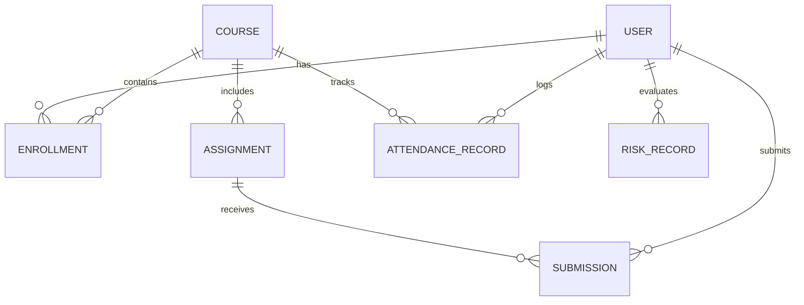

# AcadFlow Entity Relationship (ER) Diagram

```mermaid
erDiagram
    USER ||--o{ ENROLLMENT : has
    COURSE ||--o{ ENROLLMENT : contains
    COURSE ||--o{ ASSIGNMENT : includes
    ASSIGNMENT ||--o{ SUBMISSION : receives
    USER ||--o{ SUBMISSION : submits
    COURSE ||--o{ ATTENDANCE_RECORD : tracks
    USER ||--o{ ATTENDANCE_RECORD : logs
    USER ||--o{ RISK_RECORD : evaluates
```
