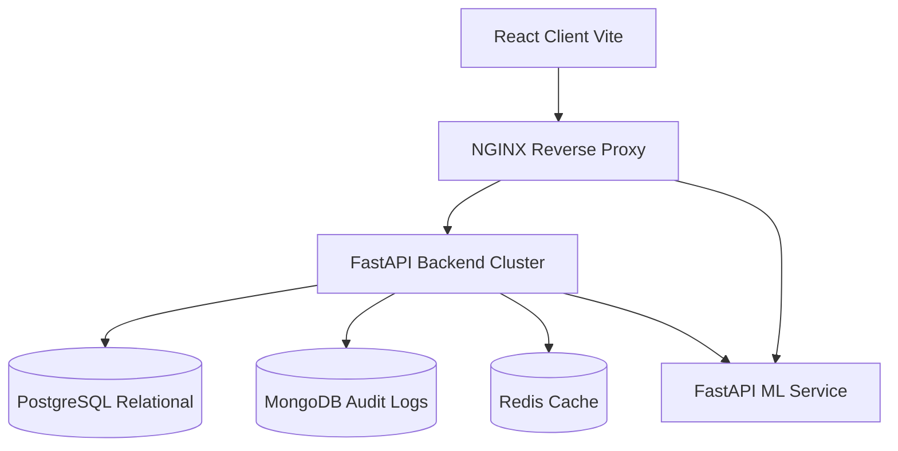

# AcadFlow System Architecture

```mermaid
flowchart TD
    Client[React Client Vite] --> NGINX[NGINX Reverse Proxy]
    NGINX --> Backend[FastAPI Backend Cluster]
    NGINX --> MLServe[FastAPI ML Service]
    Backend --> Postgres[(PostgreSQL Relational)]
    Backend --> Mongo[(MongoDB Audit Logs)]
    Backend --> Redis[(Redis Cache)]
    Backend --> MLServe
```
